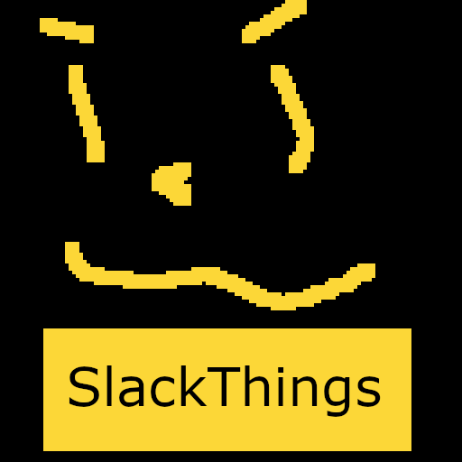

# SlackThings

stuff that is cool using [Flaron API](https://flaron.halceon.dev/)!

as you may be able to find from my [stardance project](https://stardance.hackclub.com/projects/45792) this bot was made beacuse I don't like how slakc shows the number of bot in a channels total count, so i fixed that, kind of.

## Commands / Features

- `/count` - find the number of users in a channel (usage: `/count #a-channel-name`)
- `/promote` - promote a user to full member (from mcg) (usage: `/promote @user`)
- `/things` - basic ping, help and credits cmd

## Tech Stack

Just a simple Slack Bolt in Python bot using Socket Mode.

## Try it yourself

If you are a member of the [Hack Club Slack](https://hackclub.com/slack) then you can head to my personal channel [#freddies-castle](https://hackclub.enterprise.slack.com/archives/C0AJMKSK4UW). The bot only responds to messages (only you can see) so it doesn't show up in the channel to everyone and we are happy to have you though.

## Self Host

So you want to run it yourself. All it takes is one python file!

1. Clone the repo and naviagte into the folder!

```
git clone https://github.com/hippogriff101/SlackThings
```
_make sure `git` is installed first, if not install it [here](https://git-scm.com/install/)_

```
cd SlackThings
```

2. Create a virtual environment and install dependencies

```
python -m venv .venv
```

Run one of the following depending on you os:
```
# on macOS and Linux
source .venv/bin/activate
# on windows
.\venv\Scripts\activate.bat
```
Finally run:
```
pip install -r requirements.txt
```

3. Copy `.env.example` to `.env`

```
cp .env.example .env
```

4. Set up the Slack App

- Go to [api.slack.com/apps](https://api.slack.com/apps) and create a new blank bot

- Make sure Socket Mode is turned on

- Give the bot the following Bot Scopes:

```
channels:history
channels:read
chat:write
commands
groups:read
users:read
```

- Grab the Bot User OAuth Token and paste it `SLACK_BOT_TOKEN` in your `.env`

- Create the following commands:

```
/count 
/promote
/things
```

Make sure that you tick `Escape channels, users, and links sent to your app`!

_when runing on the Hack Club Workspace change the names slighly so they don't mess with my deployment_

- Install to the workspace and find the App Token to add to `SLACK_APP_TOKEN` in your `.env`

5. Add the bot to your channel and start the bot!

```
python app.py
```

The bot includes basic logging by printing to the terminal!

For production use Slack recomends not using Socket Mode, this bot onlyy supports socket mode at this time.

## AI Transparency

This Bot was made by me! 

GitHub / VSCode Copilot and Claude Code were used for minimal debugging

I took insperation from https://github.com/hippogriff101/hackastreak  (another project) for help with `requests` as they are very similar.

this `README.md` was writen by hand! 